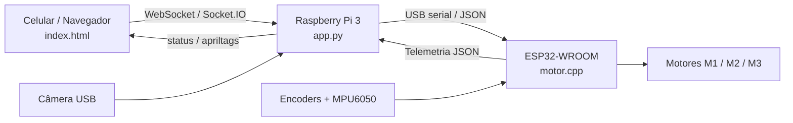
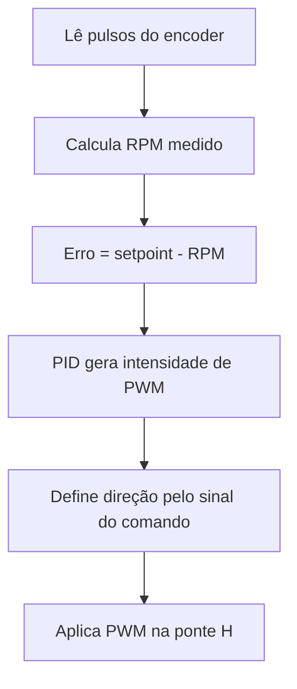
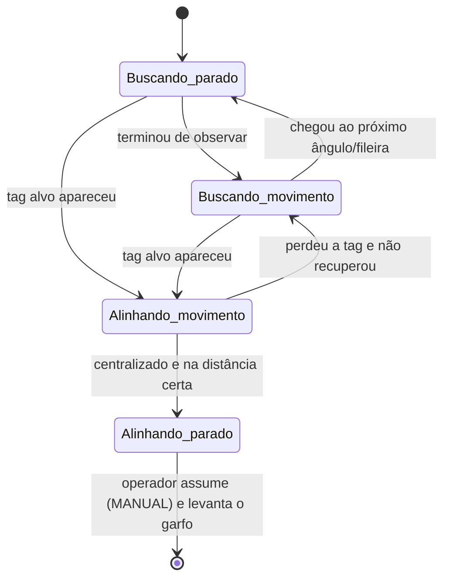

# Empilhadeira Robô Automatizada

Documentação técnica do projeto de uma empilhadeira robótica capaz de operar em
dois modos: **controle manual** por um operador (via celular ou navegador) e
**busca automática** de um alvo marcado com uma etiqueta AprilTag, usando visão
computacional e controle por realimentação.

O objetivo deste documento é explicar, de forma direta, como o sistema foi
organizado, o papel de cada peça de software e as ideias de controle por trás da
navegação autônoma.

---

## 1. Visão geral do sistema

O sistema é dividido em três programas que rodam em máquinas diferentes e
conversam entre si:

| Arquivo | Onde roda | Papel |
|---------|-----------|-------|
| `index.html` | Navegador (celular/PC) | Interface do operador: joysticks, botões e painel de estado |
| `app.py` | Raspberry Pi 3 | "Cérebro": servidor web, visão computacional (AprilTag) e máquina de estados da missão |
| `motor.cpp` | ESP32-WROOM | "Medula": leitura dos encoders/giroscópio e controle PID dos motores |

A ideia central é uma **divisão de responsabilidades por camada**:

- O **navegador** só cuida da interface e envia a intenção do operador.
- A **Raspberry Pi** decide *o que fazer* (procurar, girar, alinhar), mas não
  fala diretamente com os motores.
- O **ESP32** cuida da parte de tempo real *duro*: ler encoders, fechar o laço
  PID de velocidade e acionar as pontes H. Ele nunca decide a estratégia da
  missão; apenas obedece a comandos simples de `throttle` (avanço), `yaw` (giro)
  e `fork` (garfo).



Existem, portanto, **dois canais de comunicação distintos**:

1. **Navegador ⇄ Raspberry Pi:** WebSocket (biblioteca Socket.IO).
2. **Raspberry Pi ⇄ ESP32:** porta serial USB, trocando linhas de texto em
   formato JSON.

---

## 2. O robô por dentro (hardware controlado)

O ESP32 controla três motores DC com encoder de quadratura:

- **M1 e M2** — rodas de tração (lado esquerdo e direito). A locomoção é
  **diferencial**: avançar é girar as duas rodas juntas; virar é girar uma mais
  que a outra.
- **M3** — motor do **garfo** (subir/descer a carga).

Cada motor tem uma ponte H com dois pinos de direção e um pino de PWM
(`enable`). O ESP32 também lê um giroscópio/acelerômetro **MPU6050** por I²C, que
fornece o ângulo de rotação (yaw) usado para fechar giros precisos de 90° e 180°
no modo automático.

Os pinos principais definidos em `motor.cpp`:

| Função | GPIO |
|--------|------|
| M1 — direção A / B / PWM | 12 / 14 / 13 |
| M1 — encoder A / B | 34 / 35 |
| M2 — direção A / B / PWM | 27 / 26 / 25 |
| M2 — encoder A / B | 39 (VN) / 36 (VP) |
| M3 (garfo) — direção A / B / PWM | 23 / 22 / 5 |
| M3 — encoder A / B | 18 / 19 |
| MPU6050 — I²C SDA / SCL | 21 / 4 |
| Alimentação dos encoders — VCC / GND por GPIO | 32 (HIGH) / 33 (LOW) |

> Observação: os valores de calibração (pulsos por revolução, RPM máximo,
> ganhos, tempos de avanço) estão todos no topo dos arquivos como constantes, de
> propósito, para facilitar o ajuste em bancada. Vários deles ainda são
> estimativas de bancada, como comentado no próprio código.

---

## 3. Comunicação

### 3.1 Navegador ⇄ Raspberry Pi (WebSocket / Socket.IO)

O `app.py` sobe um servidor Flask com Socket.IO. O navegador (`index.html`) se
conecta e a partir daí a troca é toda por **eventos**, em tempo real, sem
recarregar a página. O WebSocket foi escolhido porque o controle precisa de
mensagens frequentes e de baixa latência nos dois sentidos.

**Eventos que o navegador envia para a Raspberry:**

| Evento | Conteúdo | Efeito |
|--------|----------|--------|
| `set_target` | `{ tag_id }` | Define qual AprilTag procurar (só no modo MANUAL) |
| `mode` | `{ mode: "MANUAL" \| "AUTO" }` | Alterna entre controle manual e busca automática |
| `control` | `{ throttle, yaw, fork }` | Comando dos joysticks (só tem efeito no modo MANUAL) |
| `reset_yaw` | — | Zera o ângulo de yaw integrado no ESP32 |
| `calibrate_gyro` | — | Recalibra o giroscópio (robô precisa estar parado) |

**Eventos que a Raspberry envia de volta para o navegador:**

| Evento | Uso |
|--------|-----|
| `status` | Estado da missão: modo, estado, fase, tag alvo, giroscópio, mensagem |
| `apriltags` | Tags detectadas na câmera e a pose da tag alvo |
| `telemetry` | Telemetria bruta repassada do ESP32 (RPM, PWM, garfo, giroscópio) |
| `target_result` / `mode_result` | Confirmação (ok/erro) dos comandos acima |

A interface tem três joysticks (biblioteca *nipplejs*): avanço/ré, giro e garfo.
Cada movimento do joystick vira um valor entre −1 e +1 e é enviado no evento
`control`. Para robustez, o navegador **reenvia o último comando a cada 150 ms**,
para o caso de o operador segurar o joystick parado sem gerar novos eventos.

### 3.2 Raspberry Pi ⇄ ESP32 (serial USB, JSON por linha)

A Raspberry manda para o ESP32 uma linha JSON por comando, por exemplo:

```json
{"throttle":0.24,"yaw":0.0,"fork":0.0,"mode":"AUTO","state":"BUSCA","phase":"AVANCAR"}
```

- `throttle` e `yaw` (−1 a +1) definem a velocidade e o giro desejados.
- `fork` (−1 a +1) comanda o motor do garfo.
- `mode`, `state`, `phase` são apenas informativos (usados no ESP32 para debug e
  para acender o LED de estado).
- Campos especiais como `reset_yaw` e `calibrate_gyro` disparam ações pontuais no
  giroscópio.

O ESP32 responde com um `ack` a cada comando aceito e, periodicamente (a cada
500 ms), envia um bloco de **telemetria** com RPM medido, PWM aplicado, posição
do garfo e a orientação do giroscópio. A Raspberry lê essa telemetria numa thread
separada e repassa ao navegador.

**Segurança por timeout:** se o ESP32 passar mais de **1 segundo** sem receber um
comando válido, ele **para todos os motores** sozinho. Por isso a Raspberry
mantém um laço reenviando o comando manual em frequência fixa — se a conexão cair
(navegador fechado, Wi-Fi ruim), o robô para em vez de sair descontrolado.

---

## 4. Visão computacional (AprilTag)

A navegação autônoma se apoia em **AprilTags**: etiquetas quadradas parecidas com
QR codes, porém projetadas para serem detectadas de forma rápida e robusta, com
estimativa de posição e orientação. Cada alvo da arena tem uma tag com um número
(ID) diferente.

O `app.py` usa a biblioteca `pupil_apriltags`. A cada quadro da câmera, o
programa:

1. Converte a imagem para tons de cinza e aplica equalização de histograma (ajuda
   quando a iluminação varia).
2. Detecta as tags visíveis e, para cada uma, estima a **pose 3D**.
3. Extrai o essencial: o ID e a posição da tag em relação à câmera —
   principalmente `x_mm` (deslocamento lateral) e `z_mm` (distância para frente).

Duas decisões importantes de projeto:

- **Não há streaming de vídeo.** A câmera é lida só para detectar tags; a imagem
  não é codificada nem enviada. Isso alivia bastante a CPU da Raspberry Pi 3 e
  melhora a taxa de detecção.
- **Memória temporal da tag.** A detecção pode falhar em quadros isolados mesmo
  com a tag parada na frente da câmera. Para o controle não "piscar", a última
  pose válida é considerada boa por uma fração de segundo antes de a tag ser dada
  como perdida.

O eixo mais usado no controle é o `x_mm`: se a tag está à direita do centro da
imagem, o robô gira para a direita para centralizá-la; o `z_mm` diz o quanto
ainda falta para chegar à distância de parada.

---

## 5. Controle PID dos motores (no ESP32)

Aqui está a parte de controle de baixo nível. Cada roda de tração (M1 e M2) tem
seu próprio controlador **PID de velocidade**, rodando no ESP32 a cada 100 ms.

A ideia do PID, em uma frase: ele compara a velocidade **desejada** (setpoint, em
RPM) com a velocidade **medida** pelo encoder e ajusta o PWM do motor para
eliminar a diferença (o *erro*).

- **P (proporcional):** reage ao erro atual — quanto maior a diferença, mais
  forte a correção.
- **I (integral):** acumula o erro ao longo do tempo — corrige aquele "resto"
  teimoso que o P sozinho não zera (por exemplo, atrito).
- **D (derivativo):** reage à velocidade de variação — ajuda a suavizar e evitar
  oscilação.

No código, os ganhos usados são `Kp = 2.0`, `Ki = 0.30`, `Kd = 0.0` (ou seja, na
prática um controlador **PI**, sem termo derivativo).

O laço de controle faz, em ordem:



Cuidados de engenharia já embutidos no PID:

- **Anti-windup:** o termo integral não continua acumulando quando a saída já está
  saturada (PWM no máximo ou no mínimo). Sem isso, o robô responderia com atraso
  depois de uma saturação.
- **Reset na troca de sentido:** ao inverter a direção do motor, o PID é
  reiniciado, evitando "arrasto" do estado anterior.
- **Zona morta / setpoint baixo:** setpoints muito pequenos zeram o motor, em vez
  de ficar zumbindo.

### Da intenção do operador aos dois motores (mixagem diferencial)

Os comandos chegam como `throttle` (avanço) e `yaw` (giro), mas os motores são
esquerdo e direito. A conversão é a mixagem clássica de acionamento diferencial:

```
comando_M1 = throttle + yaw
comando_M2 = throttle - yaw
```

Se a soma passar de 1, os dois valores são normalizados proporcionalmente (para
não distorcer a curva). Depois, cada comando (−1 a +1) é multiplicado pelo RPM
máximo para virar o setpoint de cada PID.

O **garfo (M3)** não usa PID de velocidade: o valor de `fork` é convertido
diretamente em PWM, com um mínimo para vencer o atrito e um máximo de segurança.

### Giroscópio: yaw por integração

O ângulo de rotação (yaw) usado no modo automático **não** vem do acelerômetro;
ele é obtido **integrando** a velocidade angular do eixo Z do MPU6050 ao longo do
tempo. Para reduzir a deriva, o ESP32 calibra o *bias* do sensor na inicialização
(robô parado) e aplica pequenas zonas mortas. É esse yaw que permite fechar giros
de 90° e 180° com precisão razoável na busca.

---

## 6. A lógica da busca automática (máquina de estados)

Quando o operador informa uma tag e ativa o modo AUTO, a Raspberry passa a
comandar o robô sozinha. A estratégia é varrer a arena parando para "olhar" para
os lados: a arena tem posições longitudinais (fileiras) e, em cada uma, pode
haver uma tag à esquerda ou à direita.

### 6.1 Os quatro estados conceituais

Do ponto de vista da ideia de controle, o robô está sempre em uma de **quatro
situações**, combinando *o que está fazendo* (procurando o alvo × alinhando ao
alvo) com *como está se movendo* (parado × em movimento):

| Estado conceitual | O que acontece |
|-------------------|----------------|
| **Buscando_parado** | Robô parado observando um lado, esperando confirmar se a tag está ali |
| **Buscando_movimento** | Robô girando 90°/180° ou avançando para a próxima fileira, ainda procurando |
| **Alinhando_movimento** | A tag alvo foi vista; o robô se move para centralizá-la e chegar à distância certa |
| **Alinhando_parado** | Robô já centralizado e na distância correta — alvo encontrado, aguardando o operador |



### 6.2 Como isso aparece no código

Na implementação (`app.py`), esses quatro estados conceituais se desdobram em
fases mais detalhadas, controladas pela classe `ControladorMissao`. O estado
geral (`EstadoMissao`) pode ser `IDLE`, `BUSCA` ou `ENCONTRADO`; dentro de
`BUSCA`, uma **fase** (`FaseBusca`) diz exatamente o que fazer. O mapeamento:

| Estado conceitual | Fases correspondentes no código |
|-------------------|---------------------------------|
| Buscando_parado | `AGUARDANDO_GIRO`, `OBSERVAR_ESQUERDA`, `OBSERVAR_DIREITA` |
| Buscando_movimento | `GIRAR_ESQUERDA`, `GIRAR_DIREITA`, `RETORNAR_FRENTE`, `AVANCAR`, `GIRAR_RETORNO` |
| Alinhando_movimento | `ALINHAR` (corrigindo), `RECUPERAR_TAG` |
| Alinhando_parado | `ALINHAR` (estável) → estado `ENCONTRADO` |

O ciclo típico de uma fileira é: girar 90° à esquerda → observar → girar 180°
para o lado direito → observar → voltar ao centro → avançar ~20 cm até a próxima
fileira. A qualquer momento, se a tag alvo aparecer na câmera, o robô interrompe a
varredura e passa ao **alinhamento**.

### 6.3 O alinhamento final

No alinhamento, o controle é **visual**, guiado pela pose da AprilTag, com dois
laços proporcionais simples:

- **Centralizar (eixo X):** gira o robô proporcionalmente ao `x_mm` da tag, até a
  tag ficar no centro da imagem.
- **Aproximar (eixo Z):** avança proporcionalmente à diferença entre a distância
  atual (`z_mm`) e a distância de parada desejada (150 mm).

Para não avançar torto, o robô **centraliza primeiro**: se o erro lateral for
grande, o avanço é bloqueado até a tag estar razoavelmente no centro. O alvo só é
declarado **encontrado** depois de o robô ficar centralizado e na distância certa
por várias amostras seguidas (evita declarar sucesso em um acerto momentâneo).

Se a tag sair do quadro durante o alinhamento, entra a fase `RECUPERAR_TAG`: o
robô faz uma pequena varredura para os dois lados tentando reencontrá-la; se não
conseguir em alguns segundos, volta a procurar do zero a partir da posição atual.

---

## 7. Segurança e robustez

Alguns cuidados que valem destaque, porque foram pensados justamente para o robô
não "fugir" do controle:

- **Timeout no ESP32 (1 s):** sem comando válido, os motores param sozinhos.
- **Reenvio periódico do comando manual:** mantém o robô "vivo" quando o operador
  segura o joystick, e garante a parada se o navegador desconectar.
- **Modo verificado nos dois lados:** o joystick é ignorado se o modo não for
  MANUAL, tanto no navegador quanto no servidor.
- **Sem giroscópio válido, sem movimento automático:** se a telemetria do yaw não
  estiver confiável, a máquina de estados mantém o robô parado.
- **LED de estado (opcional):** em placas com LED RGB, a cor indica o modo/estado
  (azul = manual, laranja = busca, roxo = recuperando tag, verde = encontrado,
  vermelho = timeout).

---

## 8. Como executar

**No ESP32:** abrir `motor.cpp` no Arduino IDE, instalar as bibliotecas
`ArduinoJson`, `ESP32Encoder`, `Adafruit_MPU6050` e `Adafruit_Unified_Sensor`, e
gravar o sketch. Manter o robô parado durante a calibração inicial do
giroscópio (~1,6 s).

**Na Raspberry Pi:** instalar as dependências e rodar o servidor:

```bash
pip install flask flask-socketio pyserial opencv-python numpy pupil-apriltags
python app.py
```

O servidor sobe em `http://<ip-da-raspberry>:5000`. Basta abrir esse endereço no
navegador do celular (na mesma rede) para acessar a interface de controle. O
ESP32 deve estar conectado por USB à Raspberry (detectado automaticamente em
`/dev/ttyUSB*` ou `/dev/ttyACM*`).

**Uso básico:**

1. Conectar-se à interface e confirmar o indicador **Online**.
2. No modo MANUAL, digitar o número da AprilTag alvo e definir.
3. Ativar o modo **AUTO** — o robô inicia a busca.
4. Ao encontrar e alinhar (estado ENCONTRADO), voltar para **MANUAL** para
   assumir o controle e levantar o garfo.

---

## 9. Estrutura do repositório

```
.
├── app.py        # Raspberry Pi: servidor web, visão (AprilTag) e máquina de estados
├── motor.cpp     # ESP32: encoders, giroscópio, PID e acionamento dos motores
├── index.html    # Interface web do operador (joysticks e painel de estado)
├── styles.css    # Estilos adicionais da interface
└── README.md     # Este documento
```

---


